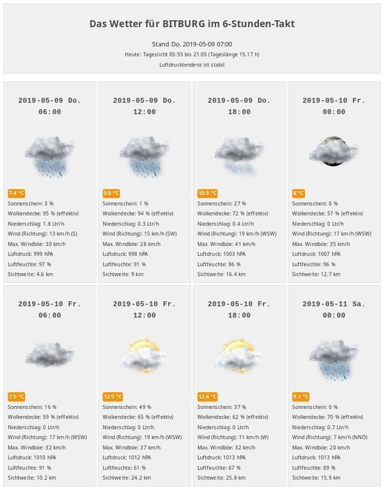
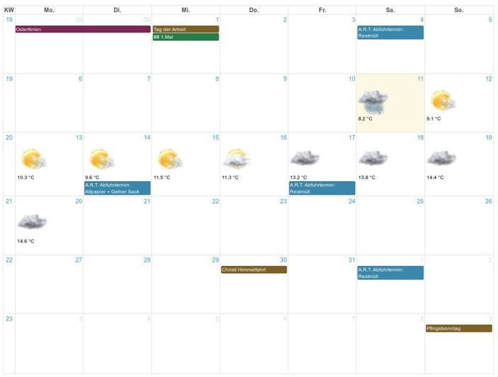

# dwdWeather
## MODX Weather Forecast

#### Wettervorhersage für MODX Revolution vom deutschen Wetterdienst
#### Weather forecast for MODX Revolution by the German Weather Service
- [Link DWD.de](https://www.dwd.de/)
- DEUTSCHE DWD-Wettervorhersage via CURL für MODX - benötigt eine Ressource, 2 Snippets und 2 Chunks
- GERMAN DWD-Weather forecast via CURL for MODX - needs one Resource, 2 Snippets and 2 Chunks

---

#### Aufruf Beispiel / example call

- Wetter Bitburg per WOEID abrufen
- get the weather for Bitburg with WOEID

```
[[!dwdWeather? &STATION=`K428` &TPL=`dwdWetterTPL`]]
[[+dwdWeather]]
```

- oder mit 4 Uhrzeiten pro Tag (T1 -T4) bei 12 Vorhersagen (QTY), also Vorhersage 3 Tage
- or with 4 times per day (T1-T4) with 12 forecasts (QTY), so forecast 3 days
```
[[!dwdWeather?
   &STATION=`K428`
   &TPL=`dwdWetterTPL`
   &QTY=`12`
   &T1=`06:00`
   &T2=`12:00`
   &T3=`16:00`
   &T4=`20:00`
]]
[[+dwdWeather]]
```

##### German INFOS und LINKS (some documents you can switch to english)
- [README opendata.dwd.de](https://opendata.dwd.de/README.txt)
- [MOSMIX-Elemente - DWD](https://www.dwd.de/DE/leistungen/opendata/help/schluessel_datenformate/kml/mosmix_elemente_pdf)
- [Content of opendata.dwd.de/weather](https://www.dwd.de/DE/leistungen/opendata/help/inhalt_allgemein/opendata_content_de_en_pdf)
- [Beschreibungen der einzelnen Parameter des Elementes Wetter (ww...)](https://www.dwd.de/DE/leistungen/opendata/help/schluessel_datenformate/kml/mosmix_element_weather_xls.html)
- [MOSMIX-Vorhersagedaten FAQ](https://rcccm.dwd.de/DE/leistungen/met_verfahren_mosmix/faq/faq_mosmix_node.html)
- [DWD Stationskatalog](https://www.dwd.de/DE/leistungen/met_verfahren_mosmix/mosmix_stationskatalog.cfg?view=nasPublication&nn=16102)
- [ww-Code - Hashs mit deutschen Konditionen (Code/Description)](https://wetterkanal.kachelmannwetter.com/was-ist-der-ww-code-in-der-meteorologie/)

##### Demo Weather Print Screen

##### Demo Weather Print Screen with [fullCalendar](https://fullcalendar.io/)


